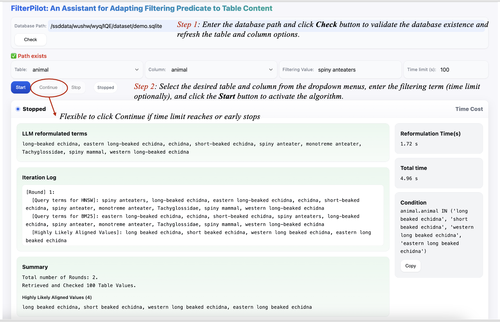

# FilterPilot: An Interactive Assistant for Adapting Filtering Predicate to Table Content



FilterPilot is an interactive system that assists the user in writing filtering conditions on textual columns, as shown in Figure. The system offers the following key features:

- **Convenient and Easy to Use:** Users can quickly get started by selecting a table and its columns, specifying a filtering value, and optionally setting a time limit. The system then automatically generates suggested filtering predicates.

- **Real-Time Inspection of Intermediate Results:** Throughout the process, users can monitor the reformulations produced by the LLM as well as the verification results in real-time.

- **Efficient and Adaptive Workflow:** The system ensures timely responses by adhering to the specified time limit and employs early stopping mechanisms to skip unnecessary verification steps.

- **Flexible Control:** Users retain full control over the process, with the flexibility to assess intermediate results and decide whether to proceed accordingly.

Our paper is submitted to VLDB Demo Track

## Environment Setup
```
conda create --name filterpilot python=3.10
conda activate filterpilot
pip install -r requirements.txt
```

## LLM Server Configuration

Configure the LLM server by setting the appropriate environment variables in the `.env` file:
```
MODEL_PATH=<model name/path>
API_KEY=<your-api-key-here>
BASE_URL=<url>
PORT=<port>
```


## Run the backend
```
uvicorn server:app --reload --port 8000
```

## Run the frontend
Open demo/index.html with Live Server